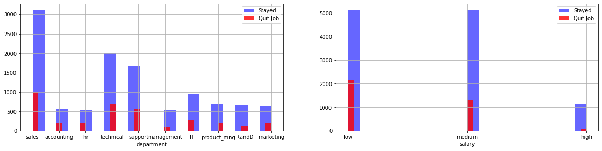
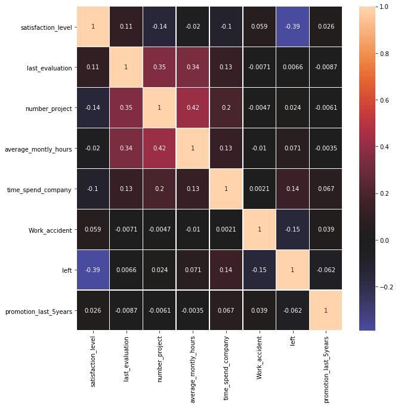
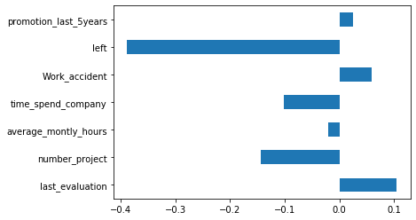
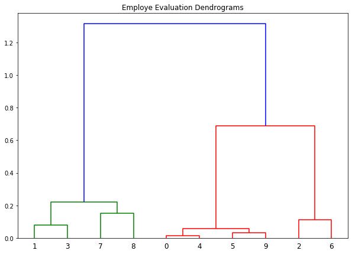

```
import pandas as pd
import matplotlib.pyplot as plt
import seaborn as sns
import scipy.cluster.hierarchy as shc
```


```
df = pd.read_csv("HR_SBA_Software.csv")
df.info()
```

    <class 'pandas.core.frame.DataFrame'>
    RangeIndex: 14999 entries, 0 to 14998
    Data columns (total 10 columns):
     #   Column                 Non-Null Count  Dtype  
    ---  ------                 --------------  -----  
     0   satisfaction_level     14999 non-null  float64
     1   last_evaluation        14999 non-null  float64
     2   number_project         14999 non-null  int64  
     3   average_montly_hours   14999 non-null  int64  
     4   time_spend_company     14999 non-null  int64  
     5   Work_accident          14999 non-null  int64  
     6   left                   14999 non-null  int64  
     7   promotion_last_5years  14999 non-null  int64  
     8   department             14999 non-null  object 
     9   salary                 14999 non-null  object 
    dtypes: float64(2), int64(6), object(2)
    memory usage: 1.1+ MB


```
df.head()
```


<div>
<style scoped>
    .dataframe tbody tr th:only-of-type {
        vertical-align: middle;
    }

    .dataframe tbody tr th {
        vertical-align: top;
    }

    .dataframe thead th {
        text-align: right;
    }
</style>
<table border="1" class="dataframe">
  <thead>
    <tr style="text-align: right;">
      <th></th>
      <th>satisfaction_level</th>
      <th>last_evaluation</th>
      <th>number_project</th>
      <th>average_montly_hours</th>
      <th>time_spend_company</th>
      <th>Work_accident</th>
      <th>left</th>
      <th>promotion_last_5years</th>
      <th>department</th>
      <th>salary</th>
    </tr>
  </thead>
  <tbody>
    <tr>
      <th>0</th>
      <td>0.38</td>
      <td>0.53</td>
      <td>2</td>
      <td>157</td>
      <td>3</td>
      <td>0</td>
      <td>1</td>
      <td>0</td>
      <td>sales</td>
      <td>low</td>
    </tr>
    <tr>
      <th>1</th>
      <td>0.80</td>
      <td>0.86</td>
      <td>5</td>
      <td>262</td>
      <td>6</td>
      <td>0</td>
      <td>1</td>
      <td>0</td>
      <td>sales</td>
      <td>medium</td>
    </tr>
    <tr>
      <th>2</th>
      <td>0.11</td>
      <td>0.88</td>
      <td>7</td>
      <td>272</td>
      <td>4</td>
      <td>0</td>
      <td>1</td>
      <td>0</td>
      <td>sales</td>
      <td>medium</td>
    </tr>
    <tr>
      <th>3</th>
      <td>0.72</td>
      <td>0.87</td>
      <td>5</td>
      <td>223</td>
      <td>5</td>
      <td>0</td>
      <td>1</td>
      <td>0</td>
      <td>sales</td>
      <td>low</td>
    </tr>
    <tr>
      <th>4</th>
      <td>0.37</td>
      <td>0.52</td>
      <td>2</td>
      <td>159</td>
      <td>3</td>
      <td>0</td>
      <td>1</td>
      <td>0</td>
      <td>sales</td>
      <td>low</td>
    </tr>
  </tbody>
</table>
</div>


```
df.describe().transpose()
```


<div>
<style scoped>
    .dataframe tbody tr th:only-of-type {
        vertical-align: middle;
    }

    .dataframe tbody tr th {
        vertical-align: top;
    }

    .dataframe thead th {
        text-align: right;
    }
</style>
<table border="1" class="dataframe">
  <thead>
    <tr style="text-align: right;">
      <th></th>
      <th>count</th>
      <th>mean</th>
      <th>std</th>
      <th>min</th>
      <th>25%</th>
      <th>50%</th>
      <th>75%</th>
      <th>max</th>
    </tr>
  </thead>
  <tbody>
    <tr>
      <th>satisfaction_level</th>
      <td>14999.0</td>
      <td>0.612834</td>
      <td>0.248631</td>
      <td>0.09</td>
      <td>0.44</td>
      <td>0.64</td>
      <td>0.82</td>
      <td>1.0</td>
    </tr>
    <tr>
      <th>last_evaluation</th>
      <td>14999.0</td>
      <td>0.716102</td>
      <td>0.171169</td>
      <td>0.36</td>
      <td>0.56</td>
      <td>0.72</td>
      <td>0.87</td>
      <td>1.0</td>
    </tr>
    <tr>
      <th>number_project</th>
      <td>14999.0</td>
      <td>3.803054</td>
      <td>1.232592</td>
      <td>2.00</td>
      <td>3.00</td>
      <td>4.00</td>
      <td>5.00</td>
      <td>7.0</td>
    </tr>
    <tr>
      <th>average_montly_hours</th>
      <td>14999.0</td>
      <td>201.050337</td>
      <td>49.943099</td>
      <td>96.00</td>
      <td>156.00</td>
      <td>200.00</td>
      <td>245.00</td>
      <td>310.0</td>
    </tr>
    <tr>
      <th>time_spend_company</th>
      <td>14999.0</td>
      <td>3.498233</td>
      <td>1.460136</td>
      <td>2.00</td>
      <td>3.00</td>
      <td>3.00</td>
      <td>4.00</td>
      <td>10.0</td>
    </tr>
    <tr>
      <th>Work_accident</th>
      <td>14999.0</td>
      <td>0.144610</td>
      <td>0.351719</td>
      <td>0.00</td>
      <td>0.00</td>
      <td>0.00</td>
      <td>0.00</td>
      <td>1.0</td>
    </tr>
    <tr>
      <th>left</th>
      <td>14999.0</td>
      <td>0.238083</td>
      <td>0.425924</td>
      <td>0.00</td>
      <td>0.00</td>
      <td>0.00</td>
      <td>0.00</td>
      <td>1.0</td>
    </tr>
    <tr>
      <th>promotion_last_5years</th>
      <td>14999.0</td>
      <td>0.021268</td>
      <td>0.144281</td>
      <td>0.00</td>
      <td>0.00</td>
      <td>0.00</td>
      <td>0.00</td>
      <td>1.0</td>
    </tr>
  </tbody>
</table>
</div>


```
for column in df.columns:
    print(f"{column}: Nombre des valeurs uniques {df[column].nunique()}")
    print("━━━━━━━━━━━━━━━━━━━━━━━━━━━━━━━━━━━━━━━━━━━━━━━━━━━━")

```

    satisfaction_level: Nombre des valeurs uniques 92
    ━━━━━━━━━━━━━━━━━━━━━━━━━━━━━━━━━━━━━━━━━━━━━━━━━━━━
    last_evaluation: Nombre des valeurs uniques 65
    ━━━━━━━━━━━━━━━━━━━━━━━━━━━━━━━━━━━━━━━━━━━━━━━━━━━━
    number_project: Nombre des valeurs uniques 6
    ━━━━━━━━━━━━━━━━━━━━━━━━━━━━━━━━━━━━━━━━━━━━━━━━━━━━
    average_montly_hours: Nombre des valeurs uniques 215
    ━━━━━━━━━━━━━━━━━━━━━━━━━━━━━━━━━━━━━━━━━━━━━━━━━━━━
    time_spend_company: Nombre des valeurs uniques 8
    ━━━━━━━━━━━━━━━━━━━━━━━━━━━━━━━━━━━━━━━━━━━━━━━━━━━━
    Work_accident: Nombre des valeurs uniques 2
    ━━━━━━━━━━━━━━━━━━━━━━━━━━━━━━━━━━━━━━━━━━━━━━━━━━━━
    left: Nombre des valeurs uniques 2
    ━━━━━━━━━━━━━━━━━━━━━━━━━━━━━━━━━━━━━━━━━━━━━━━━━━━━
    promotion_last_5years: Nombre des valeurs uniques 2
    ━━━━━━━━━━━━━━━━━━━━━━━━━━━━━━━━━━━━━━━━━━━━━━━━━━━━
    department: Nombre des valeurs uniques 10
    ━━━━━━━━━━━━━━━━━━━━━━━━━━━━━━━━━━━━━━━━━━━━━━━━━━━━
    salary: Nombre des valeurs uniques 3
    ━━━━━━━━━━━━━━━━━━━━━━━━━━━━━━━━━━━━━━━━━━━━━━━━━━━━


```
object_col = [] 
for column in df.columns:
    if df[column].dtype == object:
        print(df[column].value_counts())
        object_col.append(column)
        print("━━━━━━━━━━━━━━━━━━━━━━━━━━━━━━")
```

    sales          4140
    technical      2720
    support        2229
    IT             1227
    product_mng     902
    marketing       858
    RandD           787
    accounting      767
    hr              739
    management      630
    Name: department, dtype: int64
    ━━━━━━━━━━━━━━━━━━━━━━━━━━━━━━
    low       7316
    medium    6446
    high      1237
    Name: salary, dtype: int64
    ━━━━━━━━━━━━━━━━━━━━━━━━━━━━━━


```
num_col = [] 
for column in df.columns:
    if df[column].dtypes != object and df[column].nunique() > 2: #nuique pour ignorer les bools
        print(f"{column} : Le minimum: {df[column].min()}, Le maximum: {df[column].max()}")
        num_col.append(column)
        print("━━━━━━━━━━━━━━━━━━━━━━━━━━━━━━━━━━━━━━━━━━━━━━━━━━")
```

    satisfaction_level : Le minimum: 0.09, Le maximum: 1.0
    ━━━━━━━━━━━━━━━━━━━━━━━━━━━━━━━━━━━━━━━━━━━━━━━━━━
    last_evaluation : Le minimum: 0.36, Le maximum: 1.0
    ━━━━━━━━━━━━━━━━━━━━━━━━━━━━━━━━━━━━━━━━━━━━━━━━━━
    number_project : Le minimum: 2, Le maximum: 7
    ━━━━━━━━━━━━━━━━━━━━━━━━━━━━━━━━━━━━━━━━━━━━━━━━━━
    average_montly_hours : Le minimum: 96, Le maximum: 310
    ━━━━━━━━━━━━━━━━━━━━━━━━━━━━━━━━━━━━━━━━━━━━━━━━━━
    time_spend_company : Le minimum: 2, Le maximum: 10
    ━━━━━━━━━━━━━━━━━━━━━━━━━━━━━━━━━━━━━━━━━━━━━━━━━━


```
print("categorical : ",len(object_col)) # le nombre des variables qualificative.
print("numerical : ",len(num_col)) # le nombre des variables quantitative.
```

    categorical :  2
    numerical :  5


```
plt.figure(figsize=(20, 10))
# boucler sur les variables qualificative.
# pour visualiser le nombre d'employés quittent/restent par département/salaire
for i, column in enumerate(object_col, 1):
    plt.subplot(2, 2, i)
    # Nombre d'employés restent 
    df[df["left"] == 0][column].hist(bins=20, color='blue', label='Stayed', alpha=0.6)
    # Nombre d'employés quittent 
    df[df["left"] == 1][column].hist(bins=40, color='red', label='Quit Job', alpha=0.8)
    plt.legend()
    plt.xlabel(column)
```





```
plt.figure(figsize=(10,10)) 
# visualiser la correlation.
sns.heatmap(df.corr(), annot=True, center=0, linewidths=.5)
```


    <matplotlib.axes._subplots.AxesSubplot at 0x7f404baad410>





```
df.drop('satisfaction_level',1).corrwith(df.satisfaction_level).plot(kind='barh')
```


    <matplotlib.axes._subplots.AxesSubplot at 0x7f405d45b150>





```
# obtenir l'évaluation des 10 premiers employés.
data = df[:10].iloc[:,:2].values

plt.figure(figsize=(10, 7))
plt.title("Employe Evaluation Dendrograms")
# regrouper les employés par leur évaluation.
dend = shc.dendrogram(shc.linkage(data, method='ward'))
```



